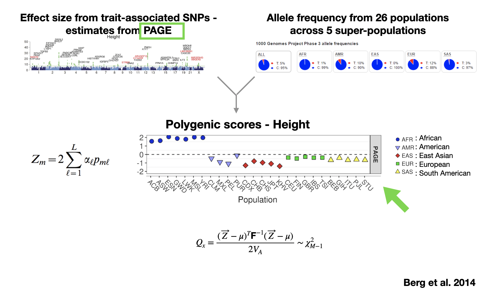

```diff
- NB! CURRENTLY UNDER DEVELOPMENT 
```

# Evaluating the robustness of polygenic adaptation to the choice of the GWAS cohort


## A - Neutrality test for polygenic scores 
### Workflow 
[]()

### Step 0: download softwares and packages 
This workflow is built in snakemake. Please, download snakemake following the instructions here:
``` https://snakemake.readthedocs.io/en/stable/getting_started/installation.html ```

Install glactools to calculate alelle frequencies for a a given population panel. Follow instructions here:
``` https://github.com/grenaud/glactools ``` 

### Step 1: download all files 
You should modify the value for all keys config.yaml with your own paths and dirs (do not modify the key name unless you change it accordingly in all snakemake files). If you are working with GRCh37, download files from:
 
```bash 
# EPO file
wget ftp://ftp.healthtech.dtu.dk/public/EPO/all_hg19.epo.gz; wget ftp://ftp.healthtech.dtu.dk/public/EPO/all_hg19.epo.gz.tbi

# FAI file
wget ftp://ftp.1000genomes.ebi.ac.uk/vol1/ftp/technical/reference/human_g1k_v37.fasta.fai

# LBD_blocks
# Download accordingly based on ancestry of the populations you are working with, e.g. EUR
wget https://bitbucket.org/nygcresearch/ldetect-data/src/master/EUR/fourier_ls-all.bed

# Summary stats
# You can find a list of traits available for the UKBB by Neale lab at: https://docs.google.com/spreadsheets/d/1kvPoupSzsSFBNSztMzl04xMoSC3Kcx3CrjVf4yBmESU/edit#gid=178908679. For instance, for height: 
wget https://broad-ukb-sumstats-us-east-1.s3.amazonaws.com/round2/additive-tsvs/50_irnt.gwas.imputed_v3.both_sexes.tsv.bgz -O 50_irnt.gwas.imputed_v3.both_sexes.tsv.bgz

# VCF file - 1000 Genomes can be download from here: 
# http://ftp.1000genomes.ebi.ac.uk/vol1/ftp/release/20130502/ 
```
Most files for GRCh38 are also available. However, you will need to liftover the LBD_blocks files. 

### Step 2: Genomic data and allele frequencies 
Get the allele frequency of the populations of interest (e.g.: populations from the 1000 Genomes Project) by running vcf2acf.smk using snakemake. The first rule is intended to get your vcf file ready (filters at the variant- and/or individual-level).

In the config file, add the path/filename under 'pops_panel'. This is a two-columnns tab-separate file with no header, first-column correspond to the sample ID and the second to the population they belong two. Example:
> head -n1 pops_panel_example_1000GP.txt <br>
> HG00096	GBR 

Once, the config file is ready. Run snakemake as follows:
```bash 
snakemake --snakefile path/to/vcf2acf.smk --cores XX
```

The final output of step1 corresponds to the file under the key 'acf_file' in the config.yaml. This file will contain the allele frequenies for each site in each populations. Intermediate files will be deleted (remove the temp() within rules to keep them). Output example (use glactools view to check the output):

> #chr    coord   REF,ALT root    anc     GBR <br>
> 1      19276348        G,A     0,0:0   0,0:0   192,14:0

More info on how to use glactools here: https://github.com/grenaud/glactools

### Compute Qx statistic

Before computing polygenic scores, if you are working with more than one GWAS, make sure their effect size is polarized by the same allele (e.g.: dervied allele). 

**rule polyAdapt_freqs**

Step1: Run `scripts/acf2ukbfreq_byP.py` to get a tabulated-file with all the info neeeded. The output is a file with the population-allele frequencies and some extra info about the variant (chr, position, alleles, beta etc.). It currently only works for the UK Biobank. However, you can very easily modify it if you are using different summary stats. When you read 'gwasfile', you will need to make sure the column numbers and names of the variables we are interested in corresponds to those in the summary stats (eg. beta value). ONLY LINES 3-43 WILL NEED MODIFICATIONS!. The output contains a new column DEREFFECT as we polarised the betas by the derived allele for compairson reasons (by default the Uk Biobank was polarised by alelel 'a1'). 

>#CHROM  POS     SNPID   REF     ALT     ANC     DER     DEREFFECT       SE      PVAL GBR XXX <br>
>1       889638  1:889638        G       C       G       C       -2.18042e-04    3.36098e-03     9.48274e-01     14,192 XXX,XXX

Step 2: Run `scripts/partitionUKB_byP.py` to get the "candidate variants". It uses the output from step 1 and the LD blocks from Berisa et al, 2019. It extracts the variant with the lowest p-value for the association test in each block (if there is at least a variant that passes the genome-wide p-value threshold 5e-8). The pvalue threshold can be changes `-p 5e-08`. Output example:
>#CHROM  POS     SNPID   DEREFFECT GBR XXX <br>
>1       930751  1:930751        5.22061e-03 34,172 <br>

Step 3: Run `scripts/extractneutral_byP.py` to get "neutral variants". You can change again the p-value for what you would like to consider "non-associated" variants similarly as in step 2 - `-p 1e-5`. The output file has the same format as in Step2. 
>#CHROM  POS     SNPID   DEREFFECT GBR XXX <br>
>1       958953  1:958953        1.01310e-02 54,152 <br>

**rule polyAdapt_qx**

Step 4: Run `scripts/CalcQX_edit4parallel_Alba.R`

It generates two output:
- QX_report: it contains the PRS for each pop, the QX value, the Chi-squared pvalue, the number of trait-associated SNPs and the sign-randomised P-value.
- PRS: two-column text file
>POP  SCORE <br>
GBR 0.55

```bash 
snakemake --snakefile path/to/polyadapt.smk --cores XX
```


## B - Assessing different association methods
> Quality control filters: 

- Genotyped SNPs (~ 800,000)
- MAF > 0.001
- HWE pvalue > 1e-10
- Autosomes

> Association models
**Examples**
- Linear model implemented in PLINK 2.0
```bash 
plink2
```
- Linear mixed model implemented in BOLT_LMM
```bash 
WHITE="/home/white"
BRI="/home/bri"
HEIGHT="/home/id_height.tsv" # tabulated file with #FID	IID	HEIGHT

cd /home/white
plink2 --bgen allind.bgen --sample allind.sample --hwe 1e-10 --maf 0.001 --keep-fam filtered_ind.list.txt 
--linear hide-covar --pheno $HEIGHT --covar allcov.tsv --covar-col-nums 3-4,8-27 --variance-standardize --out $WHITE
```
- Meta-analysis implemented in METAL
```bash 
//inverse variance based
metal

// sample size based
metal
```


